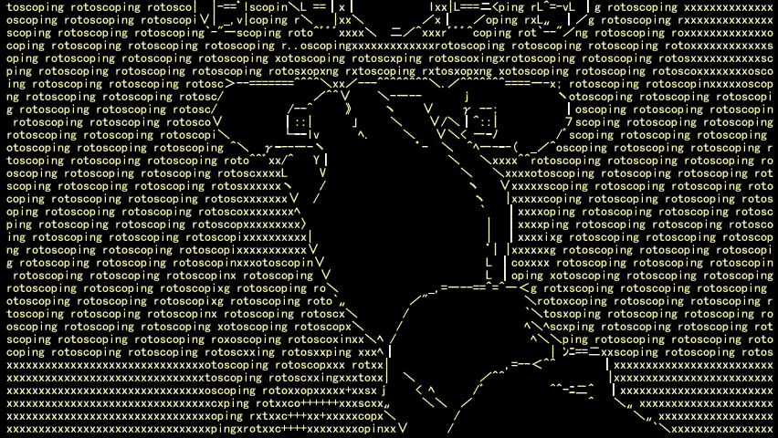
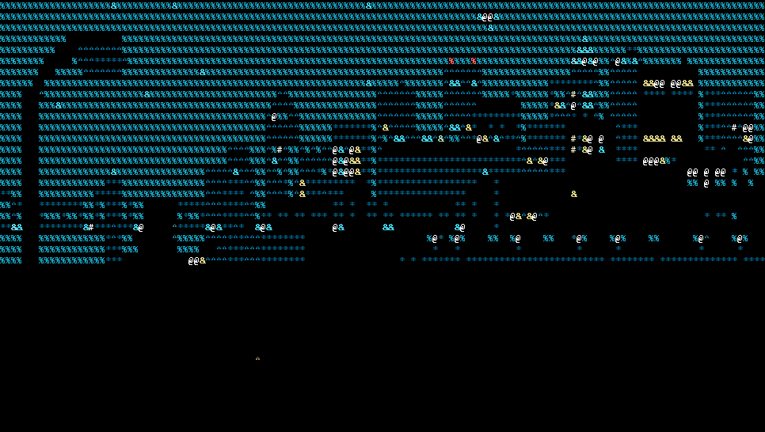

<!-- Header -->

# 🚀 Welcome to npcnon's Tech Universe

  <strong>Backend Developer | Problem Solver | Technology Enthusiast</strong> 
  <em>"Crafting robust backend solutions and exploring new technologies"</em>
---

### 👋 About Me

Hi there! I'm a backend developer based in Cebu City, Philippines. I specialize in backend development and am passionate about building scalable, efficient systems. Always eager to learn new technologies and tackle challenging problems.

#### 🎯 Professional Focus
- 💼 Junior Developer specializing in backend systems
- 🔧 Building scalable and maintainable applications
- 🌱 Continuously expanding my technical skillset
- 🤝 Open to collaboration and knowledge sharing
- 🎓 Currently pursuing growth in cloud technologies and system architecture

---

### 📊 GitHub Analytics

  
  
---

  
---

### 🛠️ Technical Stack

#### 💻 Core Languages

#### 🚀 Backend Frameworks

#### 🗄️ Databases & ORM

#### ☁️ Cloud & Deployment

#### 🔧 Development Tools & APIs

---

  
---

### 🎯 Current Focus

- Building RESTful APIs and microservices
- Exploring cloud-native development patterns
- Database optimization and design
- API security and authentication systems
- Performance monitoring and optimization

---

### 📫 Let's Connect

Open to collaboration opportunities and interesting projects!

---

  <em>⭐ Feel free to explore my repositories and don't hesitate to star any projects you find interesting!</em>
